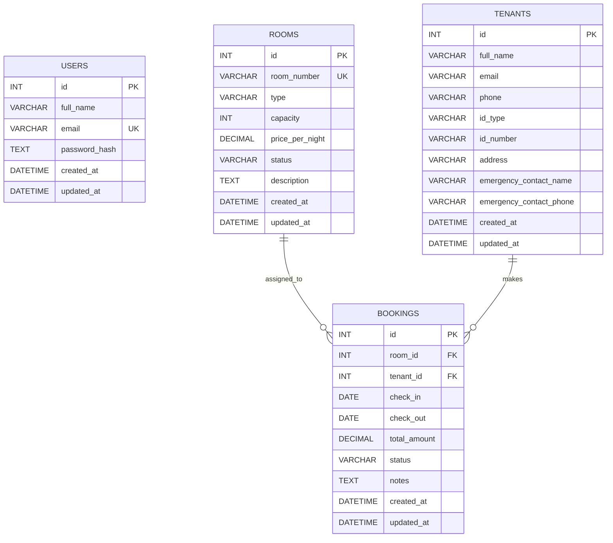

# Lodging Management System ERD

## Relationship Notes
- One room can have many bookings over time.
- One tenant can also have many bookings over time.
- Each booking belongs to exactly one room and one tenant.
- Users are kept separate from tenant records because system users are staff accounts, while tenants are lodging guests.
